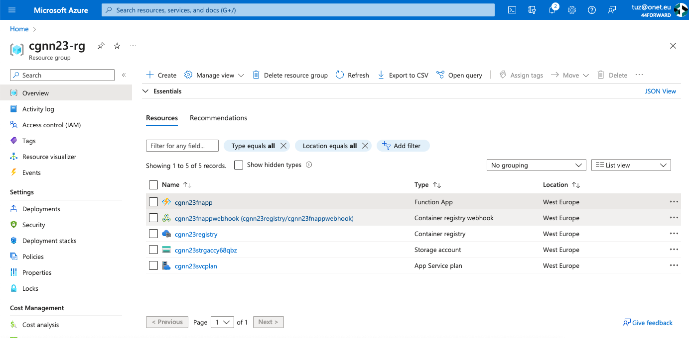
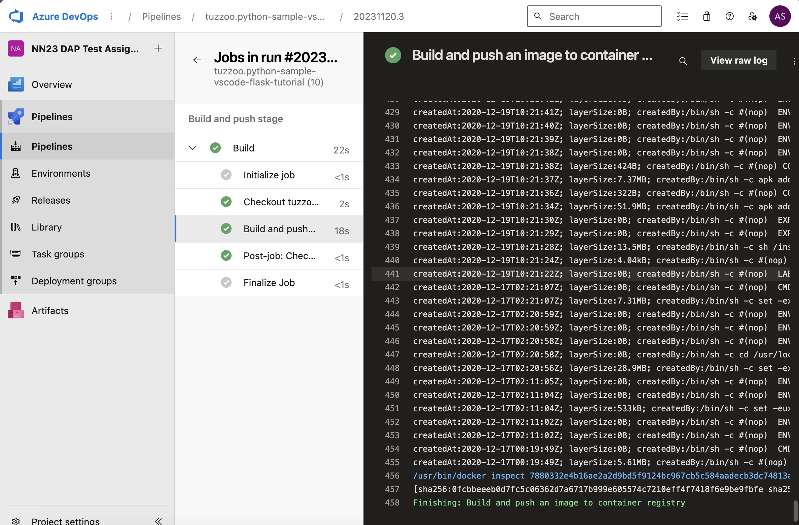
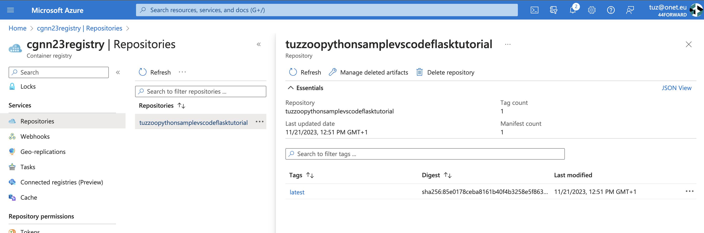
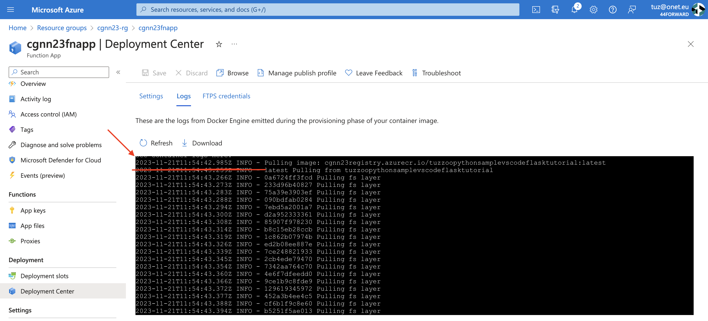
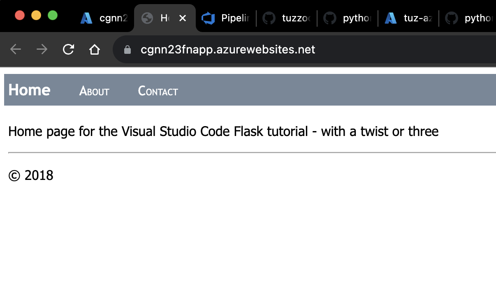
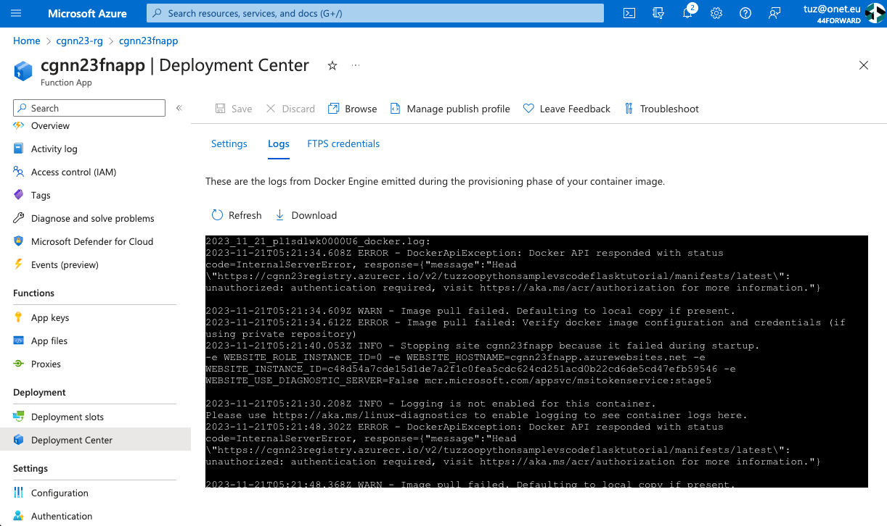
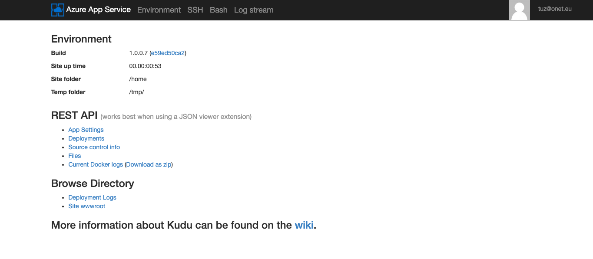

# Terraform assignment for NN 

Azure Function App from a Docker container, from Python/Linux, deployed with Terraform

- [Terraform assignment for NN](#home)
  - [Assignment](#assignment)
  - [Solution architecture](#solution)
  - [Dependencies and prerequisites](#prereqs)
  - [Deployment process](#deployment)
  - [Troubleshooting](#troubleshooting)

## Assignment 

Here are is a short summary of the assignment and status of each task:

 1. Write a terraform code that will:
  -  Create an Azure Container Registry  **(DONE)**
  -  Create a Function App that will run a Docker container   **(DONE)**
  -  Integrate the Function App with the Azure Container Registry as the source of deployment   **(DONE)**
    
 2. Create a pipeline to build the image and push it to the Azure Container Registry   **(DONE)**
 3. Create an infrastructure pipeline to provision Azure resources from Terraform code.  **(DONE)**

__Remarks__

- Integration of the Function App with the Azure Container Registry should use system-assigned identity.   **(DONE)**
- Changes should be automatically available in the Function App after pushing the image to the Container Registry.   **(DONE)**
- The Docker image to use for the sample app is available at python-sample-vscode-flask- tutorial/Dockerfile at master · microsoft/python-sample-vscode-flask-tutorial · GitHub    **(DONE)**
- The documentation for the Terraform code should include a description of the architecture, the deployment process, the dependencies and requirements, and the troubleshooting procedures. **(DONE)**
- The Terraform code should follow best practices for security, reliability, and maintainability, such as using variables, modules, and conditional expressions.  **(DONE)**

__Advanced Options (optional)__

- Configure network security groups (NSGs) and virtual network service endpoints (VNETs) to restrict inbound and outbound traffic to the Function App and the Azure Container Registry.   **(TO DO)**
- Configure retention policies for the Azure Container Registry to manage the lifecycle of Docker images and optimise storage costs.  **(TO DO)**

## Solution architecture 

Have a look at the diagram below:


## Dependencies & prerequisites  

The solution requires the following resources to be available:
- **Github** with two repositories - one to host Infrastructure Pipeline code and the other to host Application code.
In the solution I'm using my own repositories, both made public:
* [https://github.com/tuzzoo/capgem_nn](https://github.com/tuzzoo/capgem_nn) - created for the assignment and hosting Terraform code and Infrastructure Pipeline
* [https://github.com/tuzzoo/python-sample-vscode-flask-tutorial](https://github.com/tuzzoo/python-sample-vscode-flask-tutorial) - fork of the original python-flask tutorial, hosting the ApplicationCode and Application CI/CD Pipeline

- **Azure subscription** and administrative access to it. 
In the solution I'm using my private Azure subscription. 

- A resource group and storage account, with blob container is required to store Terraform state file. 
  In the solution this is present in [cgnn23-tfm-rg](https://portal.azure.com/#@44Forward.onmicrosoft.com/resource/subscriptions/3fb64972-5390-4b5d-8a12-e26109856b96/resourceGroups/cgnn23-tfm-rg/overview). 
  This resource should be created manually before the initial run of the Infrastructure Pipeline. 
  This is required to support Terraform remote statefile. See backstage configuration in [providers.tf](providers.tf).
  Using a shared remote location for management of state file is one of the best practices of team development with Terraform.  

- **Azure DevOps** project. In the solution I'm using my private ADO project [NN23 DAP Test Assignment](https://dev.azure.com/tuz-azuretests/NN23%20DAP%20Test%20Assignment). It has the Terraform plugin installed and required setup of connections to Azure Subscription and the Container Registry - all based on system managed service principles.


## Deployment process 

There are two yaml pipelines created on Azure DevOps: 
- **Infrastructure pipeline**, which uses Terraform extension to connect and create all resources on Azure, in the main resource group: cgnn23-rg
- **Application CI/CD pipeline**, which uses the code from forked "python-sample-vscode-flask-tutorial" to build a Docker image and push it to Container Registry

### Infrastructure deployment  

- The Infrastructure Pipeline uses Terraform and azurerm provider to create resources on Azure.

- The pipeline definition is present in [azure-pipelines-1.yml](./azure-pipelines-1.yml). 
- It can be executed via Azure DevOps. 
To deploy the infrastructure go to the Azure DevOps project, go to Pipelines and select the pipeline named ["Terraform init and apply pipeline"](https://dev.azure.com/tuz-azuretests/NN23%20DAP%20Test%20Assignment/_build?definitionId=34) and trigger a new run manualy (at the moment all event-based code repository triggers are disabled on purpose). 

- When the pipeline jobs complete, you should see all resources created in Azure (see illustration below).


### Terraform resources ###

Terraform and azurerm provider to create the following resources:

__1. ResourceGroup__

* See Terraform module:  ```[./ResourceGroup]```
* The _cgnn23-rg_ resource group contains all resources created.

 __2. Function App__

* See FunctionApp Terraform module: ```./FunctionApp```
* The Function App is running the application as container pulled from ContainerRegistry
* Function App is using System Identity to connect to the ContainerRegistry and StorageAccount (file share)
* "Continuous Deployment" option is enabled on the FunctionApp, and it listens to events through a Webhook
* Webhook is used to trigger Funtion App refresh whenever new image version is pushed to the ContainerRegistry

__3. Azure Container Registry__

- Container registry resource definitions are included in the FunctionApp Terraform module: ```./FunctionApp```

- The ContainerRegistry is holding images of the application code - the results of build & deployment process implemented in the Application CI/CD Pipeline
- FunctionApp System Identity is assigned the "AcrPull" role on the ContainerRegistry, so that it can pull application images from the registry. 

__4. Azure Storage Account__

- See Terraform module: ```./StorageAccount```
- The StorageAccount is required by FunctionApp to keep application files and logs.

__5. Azure App Service Plan__

- See Terraform module: ```./AppServicePlan```
- The AppServicePlan module creates a service plan (resources to manage container instances) required by the FunctionApp.


### Application code deployment   

- The Application CI/CD Pipeline is a standard Azure DevOps Pipelines. It uses a template to build a Docker image and upload it to Container Registry (the one created earlier on Azure). It can be created after the infrastructure is in place.
- Connection to the Container Registry is using system managed identity and needs to be re-established manually after the container registry is created (or re-created).  
- The pipeline definition is present in [azure-pipelines.yml](https://github.com/tuzzoo/python-sample-vscode-flask-tutorial/blob/main/azure-pipelines-9.yml). 

- Go to [Azure DevOps Pipelines](https://dev.azure.com/tuz-azuretests/NN23%20DAP%20Test%20Assignment/_build) to create, run (or re-run the pipeline manualy, if event-based code repository triggers are disabled).


- When the pipeline job completes, you should see a new repository added to the Container Registry created in Azure (see illustration below).


- Soon after the Container Registry update should be noticed by the AppFunction and the new image would be pulled automatically. 


- AppFunction would restart and as soon as the new container instance is ready you should be able to access the updated version of your Application:


## Troubleshooting  

### Azure DevOps Pipelines

- The ApplyJob of the Infrastructure Pipeline may fail if the Azure DevOps Service Connection identity service principal doesn't have the RBAC management permissions (only required for creating azurerm_role_assignment resource). When setting up Service Connections for your Azure DevOps project (Project Settings > Service Connections) for your pipeline, make sure to assign the "RBAC Access Control Administrator" role for the Service Principal matching your ADO Service Connection. You can do that via Azure Portal and scope it to your subscription, but then apply customization to limit the assignment just to "AcrPull" role. 

### Azure   

- The FunctionApp takes a couple minute to pull the image from ContainerRegistry and start up the container. Be patient. You can monitor the progress in the "Deployment / Logs" section of the FunctionApp in Azure Portal. 
- Make sure that the FunctionApp application setting "WEBSITES_PORT" (in our solution = 5000 ) matches the port number exposed by Docker in the Application code (check the  section:

```
# Set the port on which the app runs; make both values the same.
#
# IMPORTANT: When deploying to Azure App Service, go to the App Service on the Azure 
# portal, navigate to the Applications Settings blade, and create a setting named
# WEBSITES_PORT with a value that matches the port here (the Azure default is 80).
# You can also create a setting through the App Service Extension in VS Code.
ENV LISTEN_PORT=5000
EXPOSE 5000
```
- You can access the deployment logs via the "Deployment" section of your FunctionApp resource in Azure Portal (see below). This gives you a good idea of what happens in the background.

  
- For more advanced exploration of the virtual environment where your FunctionApp runs, you can use "Development Tools". Depending on your AppServicePlan SKU you may just have console or a full set of Kudu tools (see below). 

