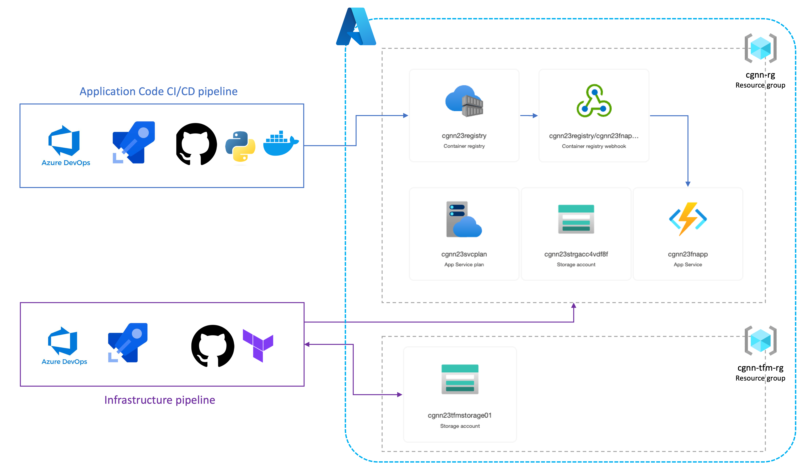

# Terraform assignment for NN 
Azure Function App from a Docker container, from Python/Linux, deployed with Terraform

- [Terraform assignment for NN](#home)
  - [Assignment](#assignment)
  - [Solution architecture](#solution)
  - [Dependencies and prerequisites](#prereqs)
  - [Deployment process](#deployment)
  - [Troubleshooting](#troubleshooting)

## Assignment 

Here are is a short summary of the assignment and status of each task:
-1. Write a terraform code that will:
  -  Create an Azure Container Registry  **(DONE)**
  -  Create a Function App that will run a Docker container   **(DONE)**
  -  Integrate the Function App with the Azure Container Registry as the source of deployment   **(DONE)**
-2. Create a pipeline to build the image and push it to the Azure Container Registry   **(DONE)**
-3. Create an infrastructure pipeline to provision Azure resources from Terraform code.  **(DONE)**

__Remarks__

- Integration of the Function App with the Azure Container Registry should use system-assigned identity.   **(DONE)**
- Changes should be automatically available in the Function App after pushing the image to the Container Registry.   **(DONE)**
- The Docker image to use for the sample app is available at python-sample-vscode-flask- tutorial/Dockerfile at master · microsoft/python-sample-vscode-flask-tutorial · GitHub    **(DONE)**
- The documentation for the Terraform code should include a description of the architecture, the deployment process, the dependencies and requirements, and the troubleshooting procedures. **(DONE)**
- The Terraform code should follow best practices for security, reliability, and maintainability, such as using variables, modules, and conditional expressions.  **(DONE)**

__Advanced Options (optional)__

- Configure network security groups (NSGs) and virtual network service endpoints (VNETs) to restrict inbound and outbound traffic to the Function App and the Azure Container Registry.   **(TO DO)**
- Configure retention policies for the Azure Container Registry to manage the lifecycle of Docker images and optimise storage costs.  **(TO DO)**

## Solution architecture 

Have a look at the diagram below:




## Dependencies & prerequisites  

The solution requires the following resources to be available:
- One storage account, with blob container is required to store Terraform state file. In the solution this is present in cgnn23-tfm-rg. 
  This resource should be created manually before the initial run of the Infrastructure Pipeline as the Terraform backstage configuration relies on it.
  (see )
  Using a shared remote location for management of state file is one of the best practices of team development with Terraform.   

## Deploymnet process 

There are two yaml pipelines created on Azure DevOps: 
- Infrastructure pipeline, which uses Terraform extension to connect and create all resources on Azure, in the main resource group: cgnn23-rg
- Application CI/CD pipeline, which uses the code from forked "python-sample-vscode-flask-tutorial" to build and push it to Container Registry

### Infrastructure deployment  

The Infrastructure Pipeline uses Terraform and azurerm provider to create the following resources:

__1. ResourceGroup__

See Terraform module: ```./ResourceGroup```
- The cgnn23-rg resource group contains all resources 

__2. Function App__

See FunctionApp Terraform module: ```./FunctionApp```
- The Function App is running the application as container pulled from ContainerRegistry
- Function App is using System Identity to connect to the ContainerRegistry and StorageAccount (file share)
- "Continuous Deployment" option is enabled on the FunctionApp, and it listens to events through a Webhook
- Webhook is used to trigger Funtion App refresh whenever new image version is pushed to the ContainerRegistry

__3. Azure Container Registry__

Definitions included in the FunctionApp Terraform module: ```./FunctionApp```
- The ContainerRegistry is holding images of the application code - the results of build & deployment process implemented in the Application CI/CD Pipeline
- FunctionApp System Identity is assigned the "AcrPull" role on the ContainerRegistry, so that it can pull application images from the registry. 


The pipeline definition is present in . 
It can be executed via Azure DevOps and requires Terraform extension to be installed there and a Service Connection to Azure Resource Manager scoped for Subscription added to the Azure DevOps Project Settings. 
To deploy the infrastructure create/ go to the Azure DevOps pipeline  and trigger it manualy. 
At the moment event-based triggers are disabled. 

__4. Azure Storage Account__

See Terraform module: ```./StorageAccount```
- The StorageAccount is required by FunctionApp to keep application files and logs.

__5. Azure App Service Plan__

See Terraform module: ```./ApServicePlan```
- The AppServicePlan module creates a service plan required by the FunctionApp


### Application code deployment   


## Troubleshooting  

- The ApplyJob of the Infrastructure Pipeline may fail if the Azure DevOps Service Connection identity principal doesn't have the RBAC management permissions (only required for creating azurerm_role_assignment resource). Alternatively you can apply this resource from your local Terraform instance, when authenticated with the Subscription "Owner" identity. 
- The FunctionApp takes a couple minute to pull the image from ContainerRegistry and start up the container. Be patient. You can monitor the progress in the "Deployment / Logs" section of the FunctionApp in Azure Portal. 
- Make sure that the FunctionApp application setting "WEBSITES_PORT" (in our solution = 5000 ) matches the port number exposed by Docker in the Application code (check the  section:

```
# Set the port on which the app runs; make both values the same.
#
# IMPORTANT: When deploying to Azure App Service, go to the App Service on the Azure 
# portal, navigate to the Applications Settings blade, and create a setting named
# WEBSITES_PORT with a value that matches the port here (the Azure default is 80).
# You can also create a setting through the App Service Extension in VS Code.
ENV LISTEN_PORT=5000
EXPOSE 5000
```
